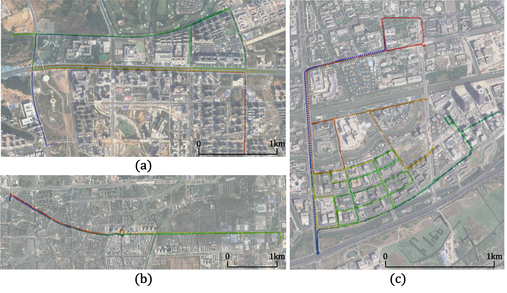
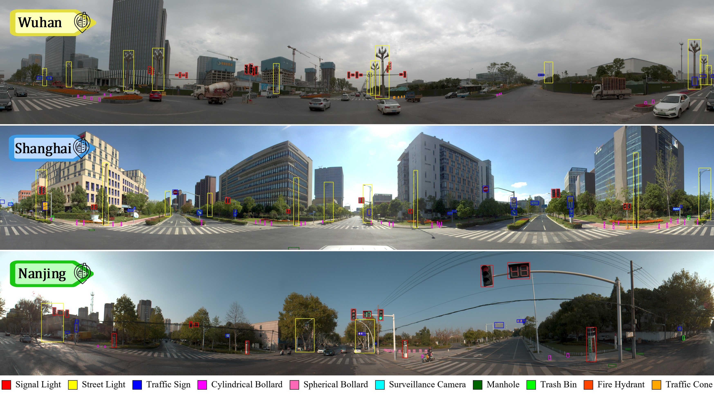
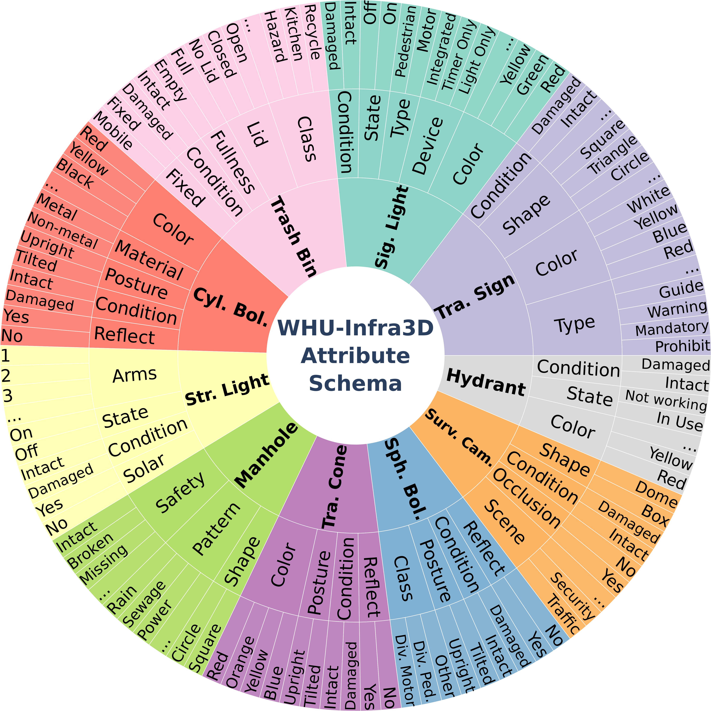
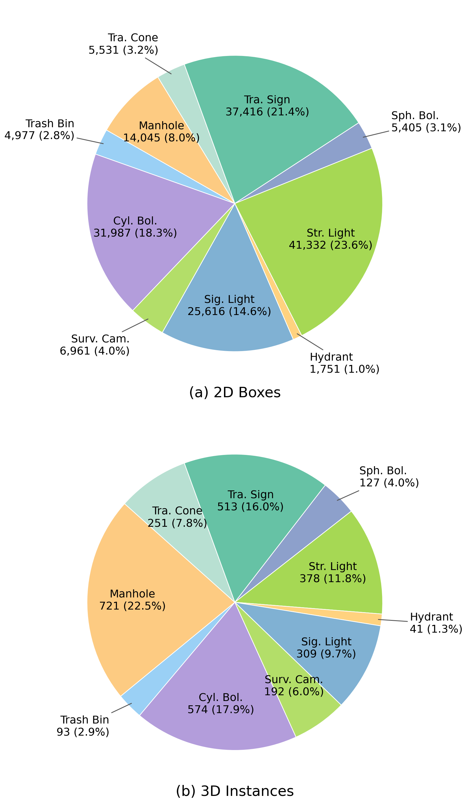

<h1 align="center"><p>WHU-Infra3D: A Full-stack Multi-modal Dataset and Benchmark for 3D Roadside Infrastructure Inventory</p></h1>

<p align="center">
  
</p>

This repository hosts the website materials and documentation for **WHU-Infra3D**.

## Introduction

WHU-Infra3D is a large-scale multi-modal benchmark for urban roadside infrastructure inventory. The dataset is designed to bridge geometric perception and fine-grained cognitive diagnosis by jointly providing panoramic images, LiDAR point clouds, 2D-3D instance association, and rich attribute/status annotations.

Key characteristics:

- Cross-city collection across **Wuhan**, **Shanghai**, and **Nanjing**.
- Large-scale coverage of **53.8 km** urban trajectories.
- **5,449** images and **175,021** 2D box annotations.
- **3,199** 3D instances and **181,351** attribute/status labels in the Core Set.
- Full-stack support for detection, matching, localization, segmentation, and attribute recognition.

## Dataset Overview & Visual Highlights

The core objective of WHU-Infra3D is to transform raw multi-modal observations into a structured roadside asset profile that possesses accurate geometry and fine-grained maintenance semantics. Rather than acting strictly as a collection of disjointed data frames, WHU-Infra3D provides a cohesive, full-stack narrative bridging 2D perception, 3D structure, and cognitive diagnosis.

### 1. The Inventory Pipeline and Architecture
At its foundation, the dataset maps physical city environments to a digital twin. We construct a complete loop: defining the infrastructure inventory task, capturing the scene with images and point clouds, and systematically translating those observations into structured asset instances.

<p align="center">
  
</p>

### 2. Large-scale Acquisition and Generalization Challenges
To ensure robust model generalization across domain gaps, data collection spanned 53.8 km of continuous trajectories across three megacities: Wuhan, Shanghai, and Nanjing. The realistic city-scale sampling brings natural class imbalance, vividly illustrated by a strict long-tail distribution in both 2D targets and 3D points.

<p align="center">
  
</p>

### 3. Comprehensive Perception in 2D and 3D Spaces
Perceiving these heterogeneous assets begins with comprehensive and varied annotations. The dataset features robust dense 2D bounding boxes in overlapping panoramic views, tightly coupled with high-quality 3D point cloud labels (including semantic classes, instance clusters, and distinct 3D geometry constraints).

<p align="center">
  
  
</p>

### 4. Continuous Association Across Views and Frames
Beyond independent frame perception, WHU-Infra3D manages cross-view duplicate observations through globally consistent cross-frame data association, which is essential for robust deduplication and stable multi-view fusion.

<p align="center">
  
</p>

### 5. Fine-grained Attribute and Status Annotation (Key Strength)
Attribute and status annotation is a core highlight of WHU-Infra3D rather than an auxiliary label. The benchmark goes beyond category recognition to capture instance-level maintenance semantics, enabling cognitive diagnosis of infrastructure conditions.

<p align="center">
  
</p>

## News

- 2026-XX-XX: WHU-Infra3D website repository initialized.
- 2026-XX-XX: Dataset release information will be updated soon.

## Download

Dataset download link:

- Google Drive: **TBD**
- Baidu Netdisk: **TBD**

Data request form:

- **TBD**

## Dataset

### Categories

WHU-Infra3D contains 10 roadside infrastructure categories:

- Traffic Sign
- Street Light
- Signal Light
- Surveillance Camera
- Cylindrical Bollard
- Fire Hydrant
- Trash Bin
- Manhole
- Traffic Cone
- Spherical Bollard

The category distribution exhibits a clear long-tail pattern in both 2D and 3D annotations:

<p align="center">
  
</p>

### Annotation Dimensions

WHU-Infra3D provides four complementary annotation dimensions:

1. 2D detection annotations on panoramic images.
2. 3D perception annotations (semantic labels, instance masks, and 3D geometry).
3. Cross-frame and cross-modal instance association IDs.
4. Fine-grained attribute and status annotations for asset diagnosis.

### Suggested Folder Structure

```text
WHU-Infra3D/
├── images/
│   ├── wuhan/
│   ├── shanghai/
│   └── nanjing/
├── pointclouds/
│   ├── wuhan/
│   ├── shanghai/
│   └── nanjing/
├── annotations/
│   ├── det2d/
│   ├── seg3d/
│   ├── tracking/
│   └── attributes/
└── metadata/
```

## Benchmark Tasks

WHU-Infra3D defines five benchmark tasks:

1. 2D Infrastructure Detection
2. 2D Cross-view Matching
3. 3D Geo-identification
4. Point Cloud Segmentation
5. Attribute Recognition

## Citation

If you find WHU-Infra3D useful in your research, please cite:

```bibtex
@article{whuinfra3d,
  title={WHU-Infra3D: A Full-stack Multi-modal Dataset and Benchmark for 3D Roadside Infrastructure Inventory},
  author={Liu, Chong and Fu, Luxuan and Feng, Xuyu and Dong, Zhen and Yang, Bisheng},
  journal={ISPRS Journal of Photogrammetry and Remote Sensing},
  year={2026},
  note={to be updated}
}
```

## Contact

For questions, please contact the maintainers via project email (to be updated).

